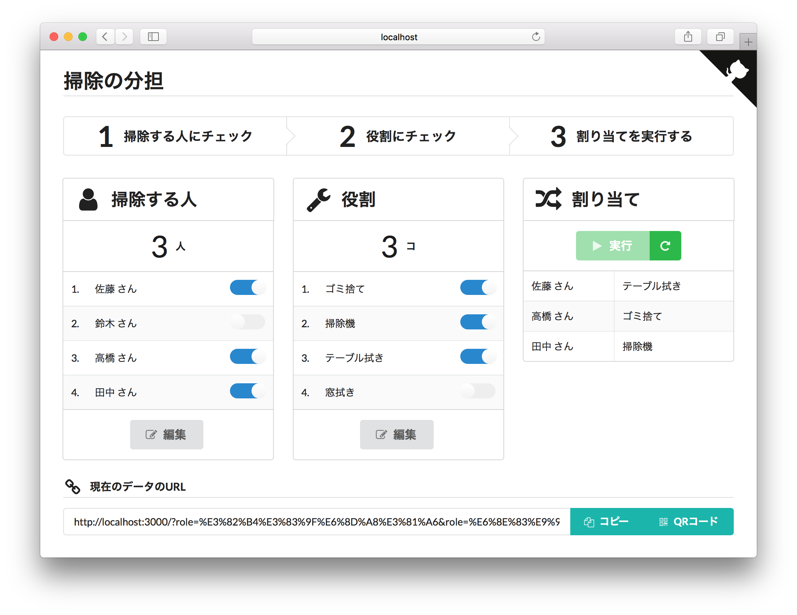

掃除の分担
====
> :twisted_rightwards_arrows: 掃除の役割をランダムに割り当てます



使い方
----
0. 人と役割を入力しておく

1. 人にチェック

2. 役割にチェック

3. 割り当てを実行

    チェックされた人に、チェックされた役割をランダムに割り当てます。  
    （注）役割のほうが多い場合は割り当てできません。

### データを保存・共有するには
URLのパラメータからデータを復元できます。
画面下部には現在入力されているデータのURLを表示しているので、コピー、ブックマーク、共有するなどしてお使いください。


開発
----

### 必要なもの
- node

### インストール
```
$ npm install
```

### 開発サーバーの立ち上げ
```
$ npm start
```


ライセンス
----
MIT
